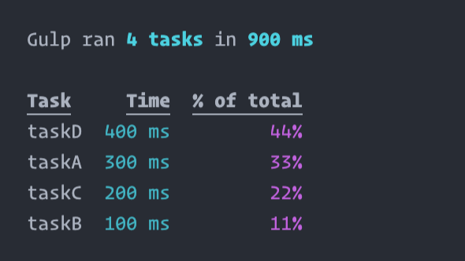

# gulp-stats

> Display stats for [Gulp](http://gulpjs.com) tasks



## Installation

```sh
$ npm i --save-dev gulp-stats
```

## Usage

Add to your `gulpfile.js` before the task(s) you wish to log and pass in the instance of Gulp.

```js
// gulpfile.js
const gulp = require('gulp');
const stats = require('gulp-stats');

// Use gulp-stats
stats(gulp);

// ... Tasks ...
```

MIT © [Mike Simmonds](https://mike.id)
