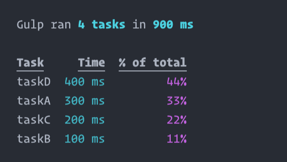

# gulp-stats

> Display stats for [Gulp](http://gulpjs.com) tasks



## Installation

```sh
$ npm install --save-dev gulp-stats
```

## Usage

Add to your `gulpfile.js` before the task(s) you wish to log and pass in the instance of Gulp.

```js
// gulpfile.js
var gulp = require('gulp');

// Use gulp-stats
require('gulp-stats')(gulp);

// ... Tasks ...
```

MIT © [Mike Simmonds](http://simmo.me)
